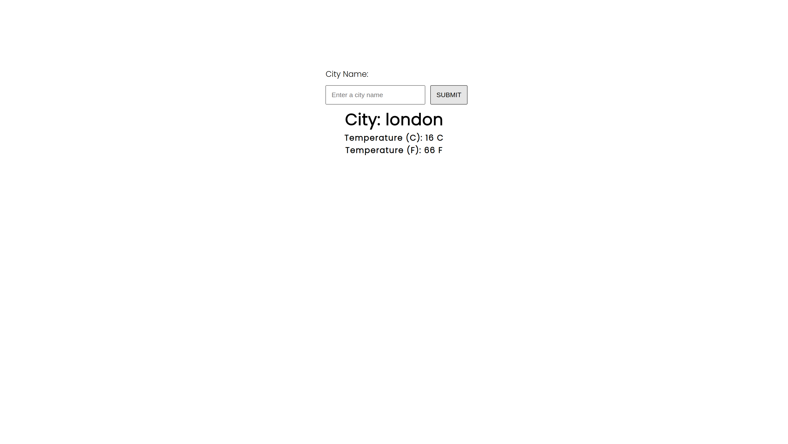
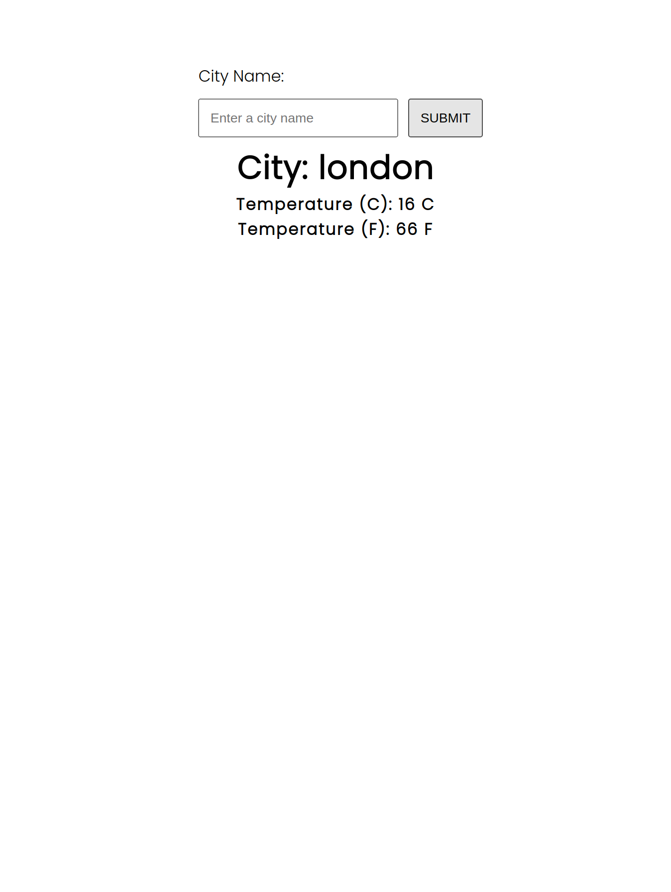

# Weather API

A simple weather API with some dummy data, build a front-end that will make a fetch to the API

## Preview:

Desktop

Mobile

## Build With:

* Node.js
* Express.js
* JavaScript
* HTML
* CSS